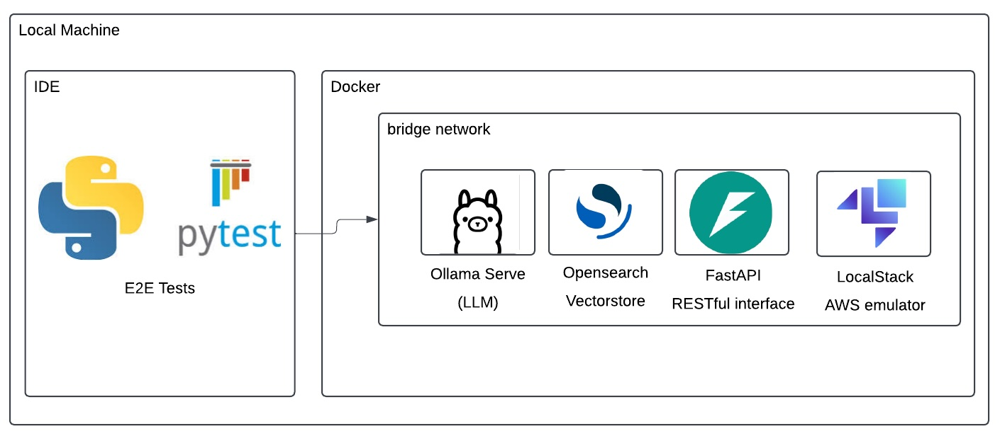
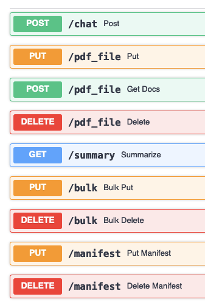

# AWS PDF RAG Quickstart

This project provides a quickstart for building a PDF RAG (Retrieval Augmented Generation) system on AWS.

## Features

- Extracts text from PDF files for processing
- Supports both multimodal and text-only LLMs for document processing
- Indexes document content in OpenSearch for efficient retrieval
- Provides RAG capabilities through LLM integration

## Usage

### Prerequisites

- Python 3.8+
- uv (Python package manager)

### Installation

```bash
uv pip install PyPDF2
```

### Configuration

For multimodal LLMs, the system can process PDF pages as images. For text-only LLMs (like local Llama models), the system extracts text from PDFs using PyPDF2.

## Implementation Notes

The system has been configured to support both text-only and multimodal workflows:

1. **Text-only LLMs**: Uses PyPDF2 to extract text from PDF documents directly.
2. **Multimodal LLMs**: Can convert PDFs to images and process the visual content.

By default, the system now uses the text extraction approach which works with any LLM, including local non-multimodal models.

# New Math Data AWS GenAI RAG Quick Start

This Quick Start will help you create an end-to-end local development environment to accelerate your AWS RAG development. 

The Quick Start provides functionality for working with unstructured content, such as:
- Metadata augmentation
- Metadata storage via OpenSearch
- Document retrieval via an LLM agent

To make your life easier, the Quick Start includes:
- A local LLM for rapid prototyping
- LocalStack for AWS services
- OpenSearch
- FastAPI for local E2E functional testing
- Terraform configurations to deploy a production-ready stack
**_NOTE:_** the local LLM is small and not multimodal, so it doesn't do well on image Q&A

# AWS RAG Architectural Pattern


# Local Testing


## Prerequisites
- Python 3.11 or higher
- Docker and docker-compose.
  - Be sure to max out resource allocation in Docker preferences, you'll need it.
- Homebrew (or your favorite package manager, substitute brew [something] commands as necessary).
- [uv](https://github.com/astral-sh/uv) for Python package management
- This repo, cloned locally. Duh.

## Testing
### Install dependencies
```bash
# Install uv if you haven't already
pip install uv

# Install the package and its dependencies
uv pip install -e .

# Install development dependencies
uv install -e ".[dev]"
```
[Terraform](https://developer.hashicorp.com/terraform) is required for obvious reasons
```bash
brew tap hashicorp/tap
brew install hashicorp/tap/terraform
```
[TFLint](https://github.com/terraform-linters/tflint) is required for terraform_tflint hook
```bash
brew install tflint
```
[Hadolint](https://github.com/hadolint/hadolint) is required for hadolint hook
```bash
brew install hadolint
```
### Run unit tests
```bash
python -m pytest tests/unit_tests.py
```
### Run coverage
```bash
coverage erase && \
coverage run -m pytest tests/unit_tests.py && \
coverage report --show-missing
```
### Linting
```bash
black -l79 src tests
isort -l79 --profile black src tests
pylama src tests
tflint
terraform fmt
```
### Pre-commit
```bash
pre-commit install
pre-commit run --all-files
```
### Local Functional Testing Steps
1. Run:
```bash
docker-compose up -d --build 
```
2. Navigate to http://0.0.0.0/docs
3. Test Each interface



### Running with or without Ollama

#### Using AWS Bedrock (Default, without Ollama)
This runs the application using AWS Bedrock for AI services, without launching the Ollama container:

```bash
# Make sure .env.bedrock is properly configured
cp .env.bedrock .env
# Run without Ollama
COMPOSE_PROFILES=default docker-compose up -d --build
```

#### Using Ollama (Local LLM)
This runs the application with the Ollama local LLM:

```bash
# Make sure .env.ollama is properly configured 
cp .env.ollama .env
# Run with Ollama
COMPOSE_PROFILES=ollama docker-compose up -d --build
```

### Index State
To check the index state:  
- Navigate to the local OpenSearch dashboard http://localhost:5601/app/home#/  
- From menu on the left, go to Index management > Indexes

# Deploy
## Credentials
We use saml2aws
```bash
brew install saml2aws
saml2aws configure 
saml2aws login 
```
## Terraform Remote State
```bash
cd terraform/remote_state
terraform init
terraform apply
```
### Terraform Deploy
```bash
cd ../live/dev
terraform init
terraform apply --auto-approve
```
terraform.tfvars values
```bash
account_id="aws_account_id"
bedrock_image_uri="aws_account_id.dkr.ecr.region_name.amazonaws.com/aws-rag/bedrock:latest"
opensearch_image_uri="aws_account_id.dkr.ecr.us-east-1.amazonaws.com/aws-rag/opensearch:latest"
ecs_opensearch_image_uri="aws_account_id.dkr.ecr.region_name.amazonaws.com/aws-rag/ecsopensearch:latest"
region_name="us-east-1"
customer="Test" # for tagging
creator="cking" # for tagging
```

